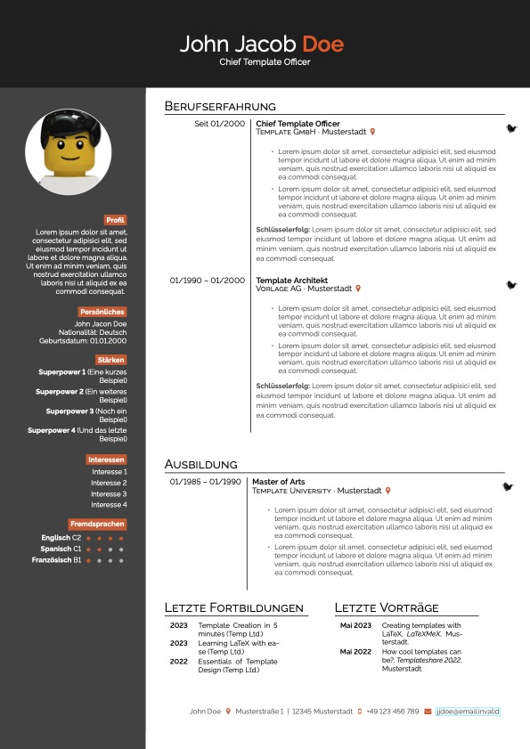

# German CV Template for LaTeX.

This is a clean and modern, yet more conventional LaTeX template for a German CV. It's primarily based on [latex-ninja's](https://github.com/latex-ninja) awesome [template](https://github.com/latex-ninja/simple-hipstercv) using the darkhipster flavor.

## Features

* Clean and modern look
* Well structured and commented
* Easily extensible and adjustable
* Looks well on screen and print
* Can be used even with little knowledge of LaTeX
* Supports two or more pages

## How does it work?

The template is designed to be used easily by LaTeX beginners. Simply change the contents of the specific sections or comment them out.

## How it's look like

## Contributing

Do you want to contribute? That’s great! Contributions are always welcome, no matter how large or small. If you found something odd, feel free to [submit a new issue](https://github.com/cypr0/latex-letter-template/issues/), improve the code by [creating a pull request](https://github.com/cypr0/latex-letter-template/pulls/), or by [sponsoring this project](https://github.com/sponsors/cypr0/).